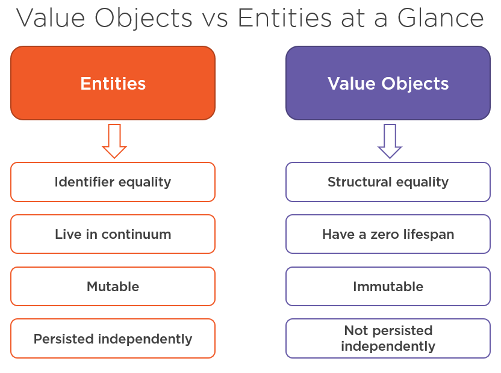
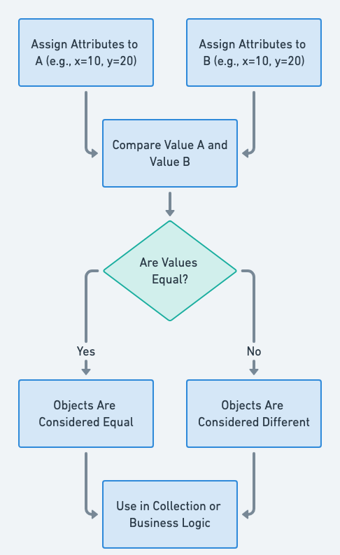

# Immutability in Java with Value Objects
#tag: EN/Java

## Difference about Value Objects vs Entities 

## What is Immutability in Java?
An immutable object is one whose state cannot change after initialization. It can be initialized with values in the constructor, but during its lifetime in Java, it cannot change the value after being initialized. In Java, we don't implement setter methods for immutable values because we guarantee that they don't change during their lifetime.

## Examples of Immutable Classes in Java
- String
- Wrapper classes for primitives (e.g. `Integer`, `Double`)
- `BigInteger` and `BigDecimal`
- Date and time classes from the `java.time` package
- UUID class 


## How to create Immutable Class?
### Basic Immutable Class Structure
```java
import java.util.*;
import java.time.LocalDate;
import java.util.concurrent.ConcurrentHashMap;

/**
 * Immutable Person class demonstrating all immutability principles
 * <p>
 * KEY IMMUTABILITY RULES:
 * - final class: prevents inheritance that could break immutability
 * - final fields: cannot be reassigned after initialization
 * - no setters: only getters are provided
 * - defensive copying: for mutable objects and collections
 * - proper equals/hashCode implementation
 * <p>
 * THREAD SAFETY: Immutable objects are inherently thread-safe
 * since there's no mutable state to corrupt
 */
public final class Person {
    private final String name;
    private final LocalDate birthDate;
    private final List<String> hobbies;
    private final Address address;
    
    /**
     * Cached hashCode for performance optimization
     * <p>
     * Since the object is immutable, hashCode will never change,
     * so we can calculate it once in the constructor and cache it.
     * This is especially important for objects used as keys in HashMap.
     */
    private final int cachedHashCode;
    
    /**
     * Constructor with defensive copying for mutable parameters
     * <p>
     * DEFENSIVE COPYING: We create copies of mutable objects to prevent
     * external modification of our internal state after construction.
     * 
     * @param name the person's name (must not be null)
     * @param birthDate the person's birth date (must not be null)
     * @param hobbies list of hobbies (will be copied defensively)
     * @param address the person's address (will be copied defensively)
     */
    public Person(String name, LocalDate birthDate, List<String> hobbies, Address address) {
        // Validation: fail fast with clear error messages
        this.name = Objects.requireNonNull(name, "Name cannot be null");
        this.birthDate = Objects.requireNonNull(birthDate, "Birth date cannot be null");
        
        /**
         * DEFENSIVE COPYING for collections:
         * 1. Create a new ArrayList to avoid external modification
         * 2. Wrap in Collections.unmodifiableList() to prevent internal modification
         * 3. Handle null case gracefully
         */
        this.hobbies = hobbies != null ? 
            Collections.unmodifiableList(new ArrayList<>(hobbies)) : 
            Collections.emptyList();
            
        /**
         * DEFENSIVE COPYING for mutable objects:
         * Use copy constructor to create independent copy
         */
        this.address = address != null ? new Address(address) : null;
        
        /**
         * PERFORMANCE OPTIMIZATION: Calculate hashCode once
         * Since object is immutable, hashCode will never change
         */
        this.cachedHashCode = Objects.hash(name, birthDate, hobbies, address);
    }
    
    /**
     * Getter methods only - no setters to maintain immutability
     */
    public String getName() { 
        return name; 
    }
    
    public LocalDate getBirthDate() { 
        return birthDate; 
    }
    
    /**
     * Returns immutable view of hobbies
     * <p>
     * No additional defensive copying needed here because we already
     * wrapped the list in Collections.unmodifiableList() in constructor
     */
    public List<String> getHobbies() { 
        return hobbies; 
    }
    
    /**
     * Returns defensive copy of address
     * <p>
     * For mutable objects, we must return a copy to prevent
     * external modification of our internal state
     */
    public Address getAddress() { 
        return address != null ? new Address(address) : null; 
    }
    
    /**
     * IMMUTABLE OPERATIONS: Methods that return new instances
     * <p>
     * Instead of modifying the current object, we return new instances
     * with the desired changes. This maintains immutability while
     * providing convenient APIs.
     */
    public Person withName(String newName) {
        return new Person(newName, birthDate, 
                         new ArrayList<>(hobbies), address);
    }
    
    public Person withAdditionalHobby(String hobby) {
        List<String> newHobbies = new ArrayList<>(hobbies);
        newHobbies.add(hobby);
        return new Person(name, birthDate, newHobbies, address);
    }
    
    /**
     * CRITICAL: Proper equals implementation for immutable objects
     * <p>
     * EQUALS CONTRACT:
     * - Reflexive: x.equals(x) must return true
     * - Symmetric: x.equals(y) == y.equals(x)
     * - Transitive: if x.equals(y) and y.equals(z), then x.equals(z)
     * - Consistent: multiple invocations return same result
     * - Non-null: x.equals(null) returns false
     */
    @Override
    public boolean equals(Object obj) {
        if (this == obj) return true; // Reflexive + performance optimization
        if (obj == null || getClass() != obj.getClass()) return false;
        
        Person person = (Person) obj;
        return Objects.equals(name, person.name) &&
               Objects.equals(birthDate, person.birthDate) &&
               Objects.equals(hobbies, person.hobbies) &&
               Objects.equals(address, person.address);
    }
    
    /**
     * CRITICAL: Proper hashCode implementation for immutable objects
     * <p>
     * HASHCODE CONTRACT:
     * - If two objects are equal, they must have same hashCode
     * - HashCode should be consistent across multiple invocations
     * - Good distribution to minimize collisions
     * <p>
     * PERFORMANCE: We return cached value calculated in constructor
     */
    @Override
    public int hashCode() {
        return cachedHashCode;
    }
    
    @Override
    public String toString() {
        return String.format("Person{name='%s', birthDate=%s, hobbies=%s, address=%s}",
                           name, birthDate, hobbies, address);
    }
}
```

### Supporting Immutable Address Class
```java 
/**
 * Immutable Address class with copy constructor
 * <p>
 * COPY CONSTRUCTOR: Essential for defensive copying in other immutable classes
 * Allows creating independent copies of Address objects
 */
public final class Address {
    private final String street;
    private final String city;
    private final String zipCode;
    
    /**
     * Cached hashCode for performance
     * <p>
     * Since Address is immutable, we can safely cache the hashCode
     * for better performance in hash-based collections
     */
    private final int cachedHashCode;
    
    /**
     * Primary constructor with validation
     */
    public Address(String street, String city, String zipCode) {
        this.street = Objects.requireNonNull(street, "Street cannot be null");
        this.city = Objects.requireNonNull(city, "City cannot be null");
        this.zipCode = Objects.requireNonNull(zipCode, "Zip code cannot be null");
        this.cachedHashCode = Objects.hash(street, city, zipCode);
    }
    
    /**
     * COPY CONSTRUCTOR: Critical for defensive copying
     * <p>
     * This constructor creates a new Address that's independent
     * of the source Address. Essential for maintaining immutability
     * when Address objects are used as fields in other immutable classes.
     */
    public Address(Address source) {
        Objects.requireNonNull(source, "Source address cannot be null");
        this.street = source.street;
        this.city = source.city;
        this.zipCode = source.zipCode;
        this.cachedHashCode = source.cachedHashCode;
    }
    
    /**
     * Getter methods only - no setters
     */
    public String getStreet() { return street; }
    public String getCity() { return city; }
    public String getZipCode() { return zipCode; }
    
    /**
     * Immutable operations returning new instances
     */
    public Address withStreet(String newStreet) {
        return new Address(newStreet, city, zipCode);
    }
    
    public Address withCity(String newCity) {
        return new Address(street, newCity, zipCode);
    }
    
    public Address withZipCode(String newZipCode) {
        return new Address(street, city, newZipCode);
    }
    
    @Override
    public boolean equals(Object obj) {
        if (this == obj) return true;
        if (obj == null || getClass() != obj.getClass()) return false;
        
        Address address = (Address) obj;
        return Objects.equals(street, address.street) &&
               Objects.equals(city, address.city) &&
               Objects.equals(zipCode, address.zipCode);
    }
    
    @Override
    public int hashCode() { 
        return cachedHashCode; 
    }
    
    @Override
    public String toString() {
        return String.format("Address{street='%s', city='%s', zipCode='%s'}", 
                           street, city, zipCode);
    }
}
```

---
## The Crucial Relationship: `equals()` and `hashCode()` for Immutable Objects

While immutability inherently provides thread-safety and predictability, it's vital to correctly implement `equals()` and `hashCode()` for your immutable classes. These methods are not directly about preventing mutation, but rather about ensuring the correct behavior of your objects when they are stored in collections, especially hash-based ones like `HashMap`, `HashSet`, or `Hashtable`.

Here's why they are different and equally important:

### `equals()`: Defining Object Equality

The `equals()` method defines **what makes two objects logically equivalent**. For immutable objects, two instances are considered "equal" if all their corresponding field values are the same.

* **Purpose:** To determine if two objects represent the same logical entity.
* **Behavior:** It compares the *values* of the fields of the objects. Since immutable objects' fields never change after construction, their equality status remains consistent throughout their lifetime.
* **Example (from `Person` class):** Two `Person` objects are equal if they have the same `name`, `birthDate`, `hobbies`, and `address`.

### `hashCode()`: Supporting Hash-Based Collections

The `hashCode()` method returns an integer hash code for an object. Its primary purpose is to **efficiently store and retrieve objects in hash-based data structures**.

* **Purpose:** To quickly determine the initial "bucket" where an object might be located in a hash table.
* **Behavior:** It transforms the object's state into a single integer. For immutable objects, because their state never changes, their `hashCode` should also never change, making caching the `hashCode` in a `final` field a powerful performance optimization.
* **Crucial Contract:** The **most important rule** linking `equals()` and `hashCode()` is:
    * **If two objects are `equals()` to each other, then they *must* have the same `hashCode()` value.**
    * The reverse is *not* true: if two objects have the same `hashCode()`, they are not necessarily `equals()`. (This is known as a hash collision, and `equals()` is then used to resolve it).

### Why Both Are Essential for Immutability

1.  **Correct Collection Behavior:** Without properly overriding both, immutable objects might behave unexpectedly in collections:
    * If `equals()` is overridden but `hashCode()` is not, two "equal" objects might end up in different hash buckets, making `contains()`, `get()`, or `remove()` operations fail.
    * If `hashCode()` is overridden but `equals()` is not, distinct objects (different memory addresses) might be considered equal by `equals()` (default `==` comparison), even if their hash codes are the same.

2.  **Predictability and Consistency:** Because immutable objects never change state, their `equals()` and `hashCode()` values are constant. This consistency is crucial for reliable application logic and data integrity when these objects are used as keys in maps or elements in sets.

3.  **Performance Optimization:** As demonstrated in your `Person` and `Address` classes, caching the `hashCode` in a `final` field inside the constructor is a common and highly effective optimization for immutable classes. Since the hash code will never change, calculating it once and storing it prevents redundant computations, especially if the object is frequently used in hash-based collections.




## Further Reading & References

To deepen your understanding of Immutability and Value Objects in Java, consider exploring the following resources:

* [https://java-design-patterns.com/patterns/value-object/#related-java-design-patterns](https://java-design-patterns.com/patterns/value-object/#related-java-design-patterns)
* [https://www.gaurgaurav.com/advancedJava_understandingImmutability](https://www.gaurgaurav.com/advancedJava_understandingImmutability)